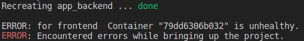
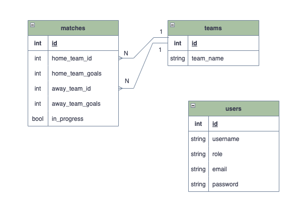

  
📃 Termos e acordos

- Ao iniciar este projeto, você concorda com as diretrizes do [Código de Conduta e do Manual da Pessoa Estudante da Trybe](https://app.betrybe.com/learn/student-manual/codigo-de-conduta-da-pessoa-estudante).

# Entregáveis

Aqui você terá acesso ao contexto geral do projeto, ou seja, seu tema central e o prazo de entrega.

  
<strong>🤷🏽‍♀️ Como entregar</strong>
 

  Para entregar o seu projeto você deverá criar um *Pull Request* neste repositório.

  Lembre-se que você pode consultar nosso conteúdo sobre *Git & GitHub* e nosso [Blog - Git & GitHub](https://blog.betrybe.com/tecnologia/git-e-github/) sempre que precisar!

<strong>👨‍💻 O que deverá ser desenvolvido</strong>
 

  

  O `TFC` é um site informativo sobre partidas e classificações de futebol! ⚽️

  No time de desenvolvimento do `TFC`, seu *squad* ficou responsável por desenvolver uma API (utilizando o método `TDD`) e também integrar *- através do docker-compose -* as aplicações para que elas funcionem consumindo um banco de dados.

  Nesse projeto, você vai construir **um back-end dockerizado utilizando modelagem de dados através do Sequelize**. Seu desenvolvimento deve **respeitar regras de negócio** providas no projeto e **sua API deve ser capaz de ser consumida por um front-end já provido nesse projeto**.

  O seu back-end deverá implementar regras de negócio para popular adequadamente a tabela disponível no front-end que será exibida para a pessoa usuária do sistema.

<strong>🏟️ Estrutura do projeto</strong>
 

O projeto é composto de 4 entidades importantes para sua estrutura:

1️⃣ **Banco de dados:**
  - Será um container docker MySQL já configurado no docker-compose através de um serviço definido como `db`.
  - Tem o papel de fornecer dados para o serviço de _backend_.
  - Durante a execução dos testes sempre vai ser acessado pelo `sequelize` e via porta `3306` do `localhost`;
  - Você também pode conectar a um Cliente MySQL (Workbench, Beekeeper, DBeaver e etc), colocando as credenciais configuradas no docker-compose no serviço `db`.

2️⃣ **Back-end:**
 - Será o ambiente que você realizará a maior parte das implementações exigidas.
 - Deve rodar na porta `3001`, pois o front-end faz requisições para ele nessa porta por padrão;
 - Sua aplicação deve ser inicializada a partir do arquivo `app/backend/src/server.ts`;
 - Garanta que o `express` é executado e a aplicação ouve a porta que vem das variáveis de ambiente;

3️⃣ **Front-end:**
  - O front já está concluído, não é necessário realizar modificações no mesmo. A única exceção será seu Dockerfile que precisará ser configurado.
  - Todos os testes a partir do requisito de login usam o `puppeteer` para simular uma pessoa acessando o site `http://localhost:3000/`;
  - O front se comunica com serviço de back-end pela url `http://localhost:3001` através dos endpoints que você deve construir nos requisitos.
  - Recomendamos que sempre que implementar um requisito no back-end acesse a página no front-end que consome a implementação para validar se está funcionando como esperado.

4️⃣ **Docker:**
  - O `docker-compose` tem a responsabilidade de unir todos os serviços conteinerizados (backend, frontend e db) e subir o projeto completo com o comando `npm run compose:up`;
  - Você **deve** configurar as `Dockerfiles` corretamente nas raízes do `front-end` e `back-end`, para conseguir inicializar a aplicação;

  
<strong> 🗓 Data de Entrega</strong>
 

  * Projeto individual;
  * Serão `7` dias de projeto;
  * Data de entrega para avaliação regular do projeto: `XX/XX/XXXX 14:00`.

# Orientações

<strong>🐳 Configuração Docker</strong>
 

⚠️ **Crie os arquivos dockerfile:**

  - As pastas `frontend/` e `backend/` devem possuir um arquivo `Dockerfile` cada, configurados corretamente para a aplicação começar a rodar. Sem essa etapa concluída o _docker-compose_ não irá funcionar.
  - Neste projeto, **não utilizar** o comando [**USER**](https://docs.docker.com/engine/reference/builder/#user) e **não alterar o usuário** para `node`.
  - ⚠ Procure usar as boas práticas no _Dockerfile_. Para isso lembre-se dos casos de uso dos comandos [**RUN**, **ENTRYPOINT** e **CMD**.](https://app.betrybe.com/learn/course/5e938f69-6e32-43b3-9685-c936530fd326/module/94d0e996-1827-4fbc-bc24-c99fb592925b/section/5987fa2d-0d04-45b2-9d91-1c2ffce09862/day/da25fd46-8818-4234-8603-a442b047370f/lesson/93c74629-1ea8-4fbd-9c2a-5db417249348)

⚠️ **Atenção:**

- Seu projeto vai conter um arquivo `docker-compose.yml` que será utilizado pelo avaliador para realizar o _build_ da aplicação, você **não** deve alterá-lo ou excluí-lo.
- O arquivo `docker-compose.yml` também pode ser utilizado para executar a aplicação na sua máquina local, para isso é necessário executar o comando `npm run compose:up` na raiz do projeto.
- Recomendamos que enquanto desenvolve o projeto, descomentar as linhas **22, 23 e 24** do arquivo `docker-compose.yml` pois, estas linhas configuram o compartilhamento de [volumes](https://docs.docker.com/storage/volumes/) com o _docker_ e também utiliza o _script_ que realiza o _live-reload_ ao fazer modificações no _back-end_. Somente quando instalar uma nova dependência ou alterar algum arquivo na raiz do backend, você deverá realizar o re-build do seu compose, pois o volume está mapeando somente alterações dentro da pasta `src`. Você pode verificar essas configurações explorando o arquivo `docker-compose.yml`

  
<strong>⚠️ Pré-requisitos para uma boa avaliação</strong>
 

⚠️ Configurar o `Dockerfile`, tanto para o _front-end_ quanto para o _back-end_, **não** é apenas o primeiro passo para garantir que sua aplicação execute corretamente. Além disso, será necessário criar as  _migrations_ e descomentar o underscore (`_`) nas _seeders_, para que o projeto seja executável via Docker.

⚠️ **A partir do fluxo de Users e Login**, a aplicação de front-end deve estar **rodando em um container**, de forma que a mesma tentará consumir sua aplicação back-end (**que deve estar saudável**, considerando os pontos anteriores).

⚠️ Para que esse projeto seja avaliado corretamente, **sua aplicação deve ter um funcionamento mínimo**. Isso porque o avaliador **vai executar um teste de usabilidade E2E** (End-to-end, ou Ponto a ponto). Para mais informações sobre esse tipo de teste, consulte este [link](https://app.betrybe.com/learn/course/5e938f69-6e32-43b3-9685-c936530fd326/module/f04cdb21-382e-4588-8950-3b1a29afd2dd/section/6d4da8fa-cc73-4bb8-9fb1-22f300dc24e7/lesson/98ae2ef9-4965-40e8-82c3-2e79e88a5dd1) do Course.

## Durante o desenvolvimento

Aqui você encontrará orientações e dicas que ajudarão muito no desenvolvimento do projeto. Sempre que tiver dúvidas ou bugs aparecerem, dê uma olhada aqui. 👀

<strong> ⚠️ Inicialização do compose e verificação dos logs das aplicações </strong>
 

- Considerando o uso do parâmetro `healthcheck` em cada container do seu `docker-compose.yml`, a inicialização dos containers deve aguardar o comando de status de saúde (o que valida se aquele container está operacional ou não):
  - No container `db`, representado por um comando `ping` no banco de dados;
  - No back-end, representado por um comando `lsof`, que vai procurar aplicações ativas na porta definida (por padrão, no caso `3001`);
  - No front-end, representado por um comando `lsof`, que vai procurar aplicações ativas na porta definida (por padrão, no caso `3000`).

- Caso os containers respeitem as premissas anteriores, os mesmos devem ser criados sem maiores problemas:

- Em caso de algum problema (no back-end, por exemplo), você deve se deparar com alguma mensagem do tipo:

> ⚠️ Lembre-se, não cabe ao avaliador de usabilidade dizer qual é o problema específico na sua aplicação, **portanto, cabe aqui investigar o problema**, sempre considerando as premissas anteriores.
- Nesse caso, a partir da pasta `./app` (onde está seu *docker-compose*), é possível rodar o comando `docker-compose logs` (Para ver todos os status) ou `docker-compose logs <nome-do-seu-serviço>` (Para mostrar somente o de um escopo específico).
  - ⚠️ é indicado remover o parâmetro `restart: 'always'` do seu serviço, para que o mesmo não polua seus logs;
  - No nosso contexto, rodando o comando `docker-compose logs backend`:

> Aqui não houve problema com o `tsc`, porém a senha para acesso ao banco pelo sequelize estava errada.

 #### ⚠️ **Inicie seu `docker-compose` antes de testar localmente!** ⚠️

  Os testes vão utilizar a sua aplicação do compose para fazer as validações, portanto **é essencial que ela esteja funcionando corretamente** para que os testes passem!

  - Para isso, garanta que as aplicações, tanto do back, quanto do front-end, possuem arquivos `Dockerfile` válidos;
  - Utilize os scripts de apoio `npm run compose:up` / `npm run compose:down`, para facilitar a execução do seu *compose*.

<strong>🔐 Criptografia de senhas </strong>
 

⚠️ A biblioteca utilizada para criptografar as senhas no banco de dados é a [bcryptjs npm](https://github.com/dcodeIO/bcrypt.js), a qual já vem instalada no projeto e não deve ser alterada ou substituída. Recomendamos que explore os recursos da biblioteca na documentação para implementá-la no projeto durante o processo de login ⚠️

  
<strong>🎲 Sequelize</strong>

   

  Para o desenvolvimento, o time de produto disponibilizou um *Diagrama de Entidade-Relacionamento (DER)* para construir a modelagem do banco de dados. Com essa imagem você já consegue saber:
  - Como nomear suas tabelas e colunas;
  - Quais são os tipos de suas colunas;
  - Relações entre tabelas.

    

  ⚠️ O `package.json` do diretório `app/backend` contém um script `db:reset` que é responsável por "dropar" o banco, recriar e executar as _migrations_ e _seeders_. Você pode executá-lo dentro do container de backend com o comando `npm run db:reset` se por algum motivo precisar recriar a base de dados;

  ⚠️ Já existem _seeders_ prontas em `app/backend/src/database/seeders`. Assim que criar uma _migration_ você deve renomear a _seeder_ correspondente retirando o underline (`_`) ao fim dela, assim o script `db:reset` vai usá-la nos testes e você se certificará se sua _migration_ funcionou como o esperado.

  ⚠️ Quaisquer execução referente ao sequelize-cli deve ser realizada dentro do diretório `app/backend`.

  ⚠️ **O sequelize já foi inicializado, portanto NÃO é necessário executar o `sequelize init` novamente**

  
<strong> 👀 Informações úteis </strong>
 

  - Ao inicializar um Workspace na raiz do projeto, podem surgir alguns erros no TypeScript. Para garantir que o editor sincronize corretamente as configurações do `tsconfig.json`, é necessário iniciar um novo Workspace dentro do diretório `backend`. Sempre verifique se está utilizando o Workspace correto no VSCode quando algum erro de configuração do TypeScript for apresentado.

  - Ao rodar o comando `npm install` na pasta raiz do projeto você estará **instalando somente as dependências para rodar os requisitos do projeto**;
  - Cada diretório (frontend e backend) possui suas próprias dependências - você pode instalá-las de forma rápida rodando o comando `npm run install:apps` na pasta raiz do projeto, ou rodando `npm install` dentro de cada diretório;

### 💡 Dicas:
  - Mais detalhes sobre o projeto acesse o [arquivo de dúvidas frequentes (FAQ)](./FAQ.md).
  - Comandos úteis e execução de testes acesse [Node e NPM](./FAQ.md#node-e-npm).